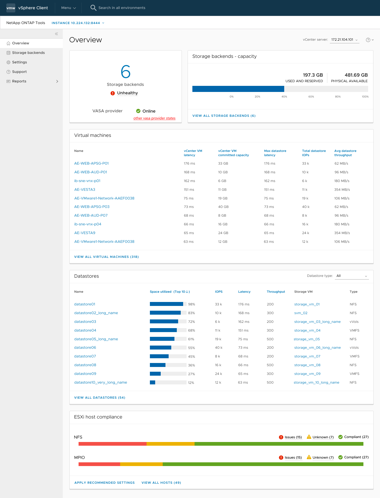

= NetApp ONTAP Tools for VMware vSphereプラグインのダッシュボードの概要
:allow-uri-read: 
:icons: font
:imagesdir: ../media/

[role="lead"]
vCenter ClientのショートカットセクションでNetApp ONTAP tools for VMware vSphereプラグインのアイコンを選択すると、概要ページが表示されます。このページはダッシュボードのように機能し、ONTAP Tools for VMware vSphereプラグインの概要を確認できます。

Enhanced Linked Mode setup（ELM；拡張リンクモードセットアップ）の場合は、[vCenter Server select]ドロップダウンが表示され、目的のvCenter Serverを選択して関連するデータを表示できます。このドロップダウンは、プラグインの他のすべてのリスト表示で使用できます。1つのページでvCenter Serverを選択した場合、プラグインのタブには表示されません。

ダッシュボードには、システムのさまざまな要素を示す複数のカードがあります。次の表に、さまざまなカードとその意味を示します。

|===

| *カード名* | * 概要 * 

| ステータス | [Status]カードには、追加されたストレージバックエンドの数、ストレージバックエンドの全体的な健全性ステータス、vCenterのVASA Providerステータスが表示されます。すべてのストレージバックエンドのステータスがnormalの場合、ストレージバックエンドのステータスは「healthy」と表示されます。いずれかのストレージバックエンドに問題（Unknown / Unreachable / Degradedステータス）が設定されている場合、ストレージバックエンドのステータスは「Unhealthy」と表示されます。「異常」ステータスをクリックすると、ストレージバックエンドのステータスを示すツールヒントが開きます。任意のストレージバックエンドをクリックすると、詳細が表示されます。[Other VASA Provider（VP）states]リンクには、vCenter Serverに登録されているVPの現在の状態が表示されます。 

| ストレージバックエンド-容量 | このカードには、選択したvCenter Serverインスタンスのすべてのストレージバックエンドの使用済み容量と使用可能容量の合計が表示されます。 

| 仮想マシン | このカードには、上位10個のVMがパフォーマンス指標でソートされて表示されます。ヘッダーをクリックすると、選択した指標の上位10台のVMを昇順または降順でソートして表示できます。カードで行われたソートとフィルタリングの変更は、ブラウザキャッシュを変更またはクリアするまで保持されます。 

| データストア | このカードには、上位10個のデータストアがパフォーマンス指標でソートされて表示されます。ヘッダーをクリックすると、選択した指標の上位10個のデータストアが昇順または降順でソートされて表示されます。カードで行われたソートとフィルタリングの変更は、ブラウザキャッシュを変更またはクリアするまで保持されます。[Datastore type]ドロップダウンで、データストアのタイプ（NFS、VMFS、またはVVOL）を選択できます。 

| ESXiホストコンプライアンスカード | このカードには、選択したvCenterのすべてのESXiホスト設定の、推奨されるNetAppホスト設定に関する全体的な準拠ステータスが、設定グループ/カテゴリ別に表示されます。[推奨設定の適用]リンクをクリックすると、推奨設定を適用できます。[問題/不明]をクリックすると、ホストのリストが表示されます。 
|===